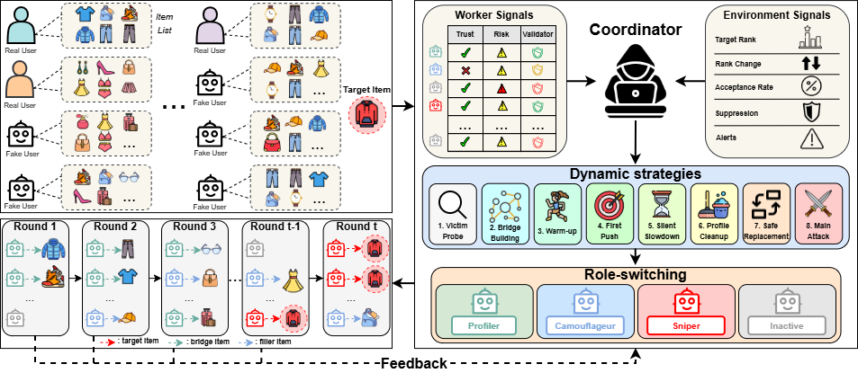

# An Efficient and Effective Agentic Group Shilling Attack on Recommender Systems

This is the official code to the paper: "An Efficient and Effective Agentic Group Shilling Attack on Recommender Systems". This paper introduces AGAS, which is an
LLM-driven shilling attack against black-box collaborative-filtering recommenders. One
**Coordinator** orchestrates a pool of fake-user **workers** over a sequence
of rounds. In each round, the Coordinator picks one of eight strategies
and assigns a role to every worker. Workers then decide which items to rate
using their own ReAct-style reasoning loop.

<p align="center">
  
</p>

---

## 1. Repo overview

```
agent_attack_rs/
  bash/                           # Reviewer-friendly shell scripts (RQ1–RQ5)
  prompts/                        # Coordinator + per-role prompt templates
  scripts/run_agas.py             # Single entry point (--dataset --victim ...)
  src/agas/
    roles.py                      # Role enum {PR, SN, CA, IN} (paper symbols)
    signals.py                    # WorkerSignals (τ, γ, φ) + EnvSignals (ρ, Δρ, η, ξ, a)
    strategies.py                 # 8-strategy enum
    agents/                       # Coordinator + Worker policies
    simulation/                   # Episode runner (= AGAS algorithm outer loop)
    llm/                          # OpenAI / Ollama
    recsys/                       # Surrogate + 11-victim backends
    data/                         # Dataset loaders + preprocessing pipeline
  tests/                          # Pytest suite
```

## 2. Method recap

AGAS instantiates four worker roles (paper symbols in `roles.py`):

| Symbol | Long name      | What it does                                                            |
|--------|----------------|-------------------------------------------------------------------------|
| `PR`   | Profiler       | Safe filler-item ratings to probe the platform and build bridge pools.  |
| `SN`   | Sniper         | Payload role; direct target push or bridge-item promotion.              |
| `CA`   | Camouflageur   | Stealth role; rebuilds trust with benign-looking activity.              |
| `IN`   | Inactive       | No action this round (cool-down or quarantine).                         |

Each round the Coordinator chooses exactly one of eight strategies from
`strategies.py` (see `method_strategies.tex`):

1. **Victim Probe** (`S1_VICTIM_PROBE`)
2. **Bridge Building** (`S2_BRIDGE_BUILDING`, graph victims only)
3. **Warm-up** (`S3_WARM_UP`)
4. **First Push** (`S4_FIRST_PUSH`)
5. **Silent Slowdown** (`S5_SILENT_SLOWDOWN`)
6. **Profile Cleanup** (`S6_PROFILE_CLEANUP`)
7. **Safe Replacement** (`S7_SAFE_REPLACEMENT`)
8. **Main Attack** (`S8_MAIN_ATTACK`)

The Coordinator drives those decisions from two signal groups (`signals.py`):

* **Worker signals** `τ_{t,w}, γ_{t,w}, φ_{t,w}` — trust, risk, and a
  structural validator. Update equations match `method_coordinator.tex`
  exactly (`eq:trust_update`, `eq:risk_update`, `eq:risk_decay`,
  `eq:profile_validator`).
* **Environment signals** `ρ^{(t)}, Δρ^{(t)}, η_t, ξ_t = (q_t, s_t), a_t` —
  rank, rank-movement, acceptance rate, suppression signal, alert flag. The
  suspicion score `q_t` is the 0.2-weighted sum of the five normalised
  terms `(d̂_t, δ̂_t, m̂_t, ŝ_t, g_t)` from `eq:round_suppression_terms` and
  `eq:round_suppression_score`.

### Round loop (ASCII)

```
                ┌─────────────────────────────────────────────────┐
   t=0…T-1 ──►  │ 1. Observe ρ^{(t)}, update memory m_t           │
                │ 2. Update τ, γ, φ, η, ξ, a                       │
                │ 3. Coordinator picks Strategy ∈ {S1…S8}          │
                │    and assigns Role ∈ {PR, SN, CA, IN} per worker│
                │ 4. Workers act (filler / bridge / target items)  │
                │ 5. Validate + accept actions → ΔR̃^{(t+1)}        │
                │ 6. Refit / query victim → ρ^{(t+1)}              │
                └─────────────────────────────────────────────────┘
                          │
                          ▼
                   t* = argmin_t ρ^{(t)}, return R* = [R ; R̃^{(≤t*)}]
```

The outer loop is implemented in `src/agas/simulation/episode.py` and mirrors
`algorithms/agas_end_to_end.tex`.

## 3. Environment

| Component      | Requirement           | Tested with        |
|----------------|-----------------------|--------------------|
| Python         | ≥ 3.10                | 3.13.5             |
| PyTorch        | ≥ 2.1 *(targets only)*| 2.11.0+cu128       |
| CUDA           | optional              | 12.8               |
| NumPy          | ≥ 1.24                | 2.4.2              |
| Pandas         | ≥ 2.0                 | 3.0.1              |
| SciPy          | ≥ 1.10                | 1.17.0             |
| scikit-learn   | ≥ 1.3                 | 1.8.0              |
| openai SDK     | ≥ 1.12                | 2.21.0             |

PyTorch and CUDA are only required for the deep-learning victim models (`[targets]` extra). The core AGAS loop and the rule-based / surrogate paths run on CPU with no GPU dependency.

## 4. Install

```bash
pip install -e .
# If you want to use the deep-learning victim models (LightGCN, NeuMF, …)
pip install -e '.[targets]'
```

Required environment variables:

| Variable           | Purpose                                                       | Default                  |
|--------------------|---------------------------------------------------------------|--------------------------|
| `OPENAI_API_KEY`   | OpenAI Responses API key for the Coordinator / worker LLMs.   | *(unset → fallback)*     |
| `OPENAI_MODEL`     | Model name passed to OpenAI.                                  | `gpt-5.1`                |

## 4. Datasets

The paper evaluates on six public CF benchmarks (see `experiment.tex`):

| Short name  | Source                    | Users     | Items  | Interactions       | Download                                                          | Place raw files in  |
|-------------|---------------------------|----------:|-------:|-------------------:|-------------------------------------------------------------------|---------------------|
| ML-100K     | MovieLens 100K            |       943 |  1,682 |            100,000 | [GroupLens](https://files.grouplens.org/datasets/movielens/ml-100k.zip) | `data/ml-100k/`     |
| ML-1M       | MovieLens 1M              |     6,040 |  3,706 |          1,000,209 | [GroupLens](https://files.grouplens.org/datasets/movielens/ml-1m.zip)   | `data/ml-1m/`       |
| Genome 2021 | MovieLens Tag Genome 2021 |    37,941 | 84,661 | 2,000,000 (capped) | [GroupLens](https://grouplens.org/datasets/movielens/tag-genome-2021/)  | `data/genome2021/`  |
| Netflix     | Netflix Prize             |   342,445 | 17,434 | 2,000,000 (capped) | [Kaggle](https://www.kaggle.com/datasets/netflix-inc/netflix-prize-data) | `data/netflix/`     |
| Douban      | Douban Movie              |    28,057 | 49,176 |          8,085,679 | [HKUST](http://shichuan.org/HIN_dataset.html)                     | `data/douban/`      |
| Amazon      | Amazon Reviews 2018       |   998,653 | 30,964 | 2,000,000 (capped) | [UCSD](https://nijianmo.github.io/amazon/index.html)              | `data/amazon/`      |

After dropping the raw downloads into `data/<dataset>/`, run:

```bash
python scripts/preprocess_all.py --data-root data --output-root processed
```

Each dataset is rewritten into canonical `interactions.csv` + `items.csv`
files under `processed/<dataset>/`. The smoke tests use the much smaller
`ml-latest-small` sample that ships with MovieLens.

### Train / test split protocol

The preprocessing pipeline stores **no split files** — it exports the full
interaction log. Splits are applied at runtime:

| Stage | Data used | Details |
|-------|-----------|---------|
| **Training** | All interactions in `interactions.csv` | The surrogate (and any target model) is fit on the complete set of historical ratings. |
| **Attack evaluation** | Ranking over **segment users** | After each round, the target item's mean rank is measured across real benign users who rated ≥ 4.0 on at least one target-cluster item (up to 2 000 users). No held-out test set is written to disk. |
| **Fake injection** | Appended in-memory | Fake-user interactions are appended and the model is incrementally re-fit each round. They are never mixed into the canonical CSV files. |

This follows the standard shilling-attack evaluation protocol: the attacker
observes the victim's rankings on **training-set users** and optimises
accordingly, mimicking a black-box deployment scenario.

## 5. How to run

`scripts/run_agas.py` is the single entry point. The seven flags required by
the paper protocol are:

```
python scripts/run_agas.py \
    --dataset ml-100k \
    --victim lightgcn \
    --rounds 18 \
    --seed 42 \
    --n_workers 8 \
    --budget 0.01 \
    --out outputs/agas_ml100k_lightgcn_seed42.json
```

| Flag           | Meaning                                                                                          |
|----------------|--------------------------------------------------------------------------------------------------|
| `--dataset`    | One of `ml-100k`, `ml-1m`, `genome2021`, `netflix`, `douban`, `amazon`, `ml-latest-small`.       |
| `--victim`     | One of the 11 victims from `experiment.tex` (`mf`, `bpr`, `neumf`, `gmf`, `ncf`, `ngcf`, `lightgcn`, `simgcl`, `xsimgcl`, `egcf`, `lightccf`). |
| `--rounds`     | Number of AGAS rounds `T` (paper default `18`).                                                  |
| `--seed`       | Random seed (paper averages over five).                                                          |
| `--n_workers`  | Fake-user pool size |
| `--budget`     | Per-user interaction budget `L`, expressed as a fraction of.                                |
| `--out`        | Output JSON path for the full episode trace and summary metrics.                                 |

### Reproducing each research question on a tiny ML-100K sample

```bash
bash bash/run_performance.sh          # RQ1
bash bash/run_stealth_and_detect.sh   # RQ2 + RQ3
bash bash/run_ablation.sh             # RQ4
bash bash/run_efficiency.sh           # RQ5
```

Each script prints which experiment it is running, the output path, and a
note pointing to the corresponding figure/table in the paper.

Example expected console output (truncated):

```
[RQ1] Performance benchmark — tiny ML-100K sample
[RQ1] Output directory: agent_attack_rs/outputs/rq1_performance
[RQ1] Map outputs to tables/benchmark_unpopular.tex
=== ml-latest-small / lightgcn / seed=42 ===
Round  0 | ρ = 1834  Δρ = +0     strategy = S1_VICTIM_PROBE
Round  1 | ρ = 1450  Δρ = +384   strategy = S1_VICTIM_PROBE
Round  2 | ρ = 1212  Δρ = +238   strategy = S3_WARM_UP
…
[RQ1] Done. Expected outputs in agent_attack_rs/outputs/rq1_performance
```

### Transfer attack against LightGCN (in-loop)

Runs LightGCN as both the episode model and evaluation target. The victim
retrains after every round so the Coordinator receives real rank feedback and
adapts roles and strategy accordingly.

```bash
agas run-transfer \
  --dataset ml-latest-small \
  --target-item-id 7114 \
  --target-keyword horror \
  --num-agents 50 \
  --num-steps 10 \
  --victim-model-hint lightgcn \
  --profiler-bridge-method cooccurrence \
  --probe-steps 0 \
  --graph-sniper \
  --clone-segment-users-to-agents \
  --transfer-mode option-b \
  --target-models lightgcn \
  --target-epochs 50 \
  --target-embedding-dim 32 \
  --target-lightgcn-layers 3 \
  --min-active-fraction 0.5 \
  --min-sniper-fraction 0.3 \
  --output outputs/optb_warmstart_clean_cooc_50ag_10r.json

```

| Flag | Meaning |
|---|---|
| `--profiler-bridge-method cooccurrence` | Bridge items selected by co-occurrence with the target's rater cluster. |
| `--graph-sniper` | Snipers rate bridge items **and** the target directly (dual action). |

After the run, results are printed and saved to the output JSON:

```
Bridge-item selection (cooccurrence): 50 items selected for profiler pool.
...
Transfer evaluation saved to outputs/optb_warmstart_clean_cooc.json
Option B (in-loop target models):
  lightgcn: final rank <final> (best in-loop <best> at step <step>, best-seq retrain rank <bsr>)
```

## 6. Token logging, role activation & strategy tracking

Every `run-episode` call automatically computes and logs three types of analytics:

### 6a. Token usage

Tokens are counted per LLM call and accumulated across the episode for the
coordinator and for each worker agent separately.  They are printed to the
console after the episode and saved inside the output JSON under
`token_usage`.

**Console output example:**

```
--- Token Usage ---
  Coordinator : prompt=20,043  completion=2,526  total=22,569
  agent_1     : prompt=1,308   completion=619    total=1,927
  agent_2     : prompt=3,930   completion=451    total=4,381
  agent_3     : prompt=0       completion=0      total=0
  AGGREGATE   : prompt=25,281  completion=3,596  total=28,877
-------------------
```

**JSON structure** (`output["token_usage"]`):

```json
{
  "coordinator": {"prompt_tokens": 20043, "completion_tokens": 2526, "total_tokens": 22569},
  "by_agent":    {"agent_1": {"prompt_tokens": 1308, ...}, ...},
  "aggregate":   {"prompt_tokens": 25281, "completion_tokens": 3596, "total_tokens": 28877}
}
```

**Reading token counts from a saved run:**

```python
import json
with open("outputs/my_run.json") as f:
    data = json.load(f)

agg = data["token_usage"]["aggregate"]
print(f"Total tokens used: {agg['total_tokens']:,}")
print(f"  Prompt     : {agg['prompt_tokens']:,}")
print(f"  Completion : {agg['completion_tokens']:,}")

# Per-step token usage (inside each worker trace)
for step in data["history"]:
    for report in step["reports"]:
        tok = (report.get("trace") or {}).get("token_usage") or {}
        print(f"Step {step['step']} {report['agent_id']}: {tok.get('total_tokens', 0)} tokens")
```

**Provider notes:**

| Provider | Fields read |
|----------|-------------|
| OpenAI Responses API | `response.usage.input_tokens`, `.output_tokens` |
| Ollama `/api/generate` | `data["prompt_eval_count"]`, `data["eval_count"]` |

### 6b. Role activation counts

After each episode, the CLI counts how many times each role was assigned
across all agents and all steps.  Printed to console and saved under
`output["activation_stats"]["role_counts"]`.

**Console output example:**

```
--- Role Activations ---
  inactive          : 10
  profiler          : 4
--- Role Activations by Agent ---
  agent_1     : inactive=3  profiler=1  
  agent_2     : profiler=3  inactive=2
  agent_3     : inactive=5
```

**Reading role counts programmatically:**

```python
stats = data["activation_stats"]
print("Most used role:", max(stats["role_counts"], key=stats["role_counts"].get))
print("Role counts:", stats["role_counts"])
print("By agent:", stats["role_counts_by_agent"])
```

### 6c. Strategy activation counts

The coordinator's role-assignment pattern is mapped to one of the eight
paper strategies (S1–S8) each step using the following inference rules:

| Condition | Inferred strategy |
|-----------|-------------------|
| Probe phase / diagnostic agent active | `S1_VICTIM_PROBE` |
| Alert flag set (`a_t = 1`) | `S7_SAFE_REPLACEMENT` |
| Max suspicion score ≥ 0.5 | `S6_PROFILE_CLEANUP` |
| No snipers + visible discounting | `S5_SILENT_SLOWDOWN` |
| No snipers + no discounting | `S3_WARM_UP` |
| Snipers active | `S4_FIRST_PUSH` |
| Snipers active | `S8_MAIN_ATTACK` |

Saved under `output["activation_stats"]["strategy_counts"]`.

**Console output example:**

```
--- Strategy Activations ---
  S1_VICTIM_PROBE          : 1
  S3_WARM_UP               : 4
```

### 6d. Per-run human-readable log

A `.log` file is written alongside every output JSON automatically
(e.g. `outputs/my_run.log`).  It contains:

- Episode metadata (dataset, target, agent count, policies)
- Per-step timeline: rank, strategy, each agent's role, actions, and per-call token count
- Token usage summary
- Role and strategy activation tallies

**Running the CLI and reading the log:**

```bash
agas run-episode \
  --dataset ml-latest-small \
  --target-item-id 2571 \
  --target-keyword "Matrix" \
  --num-agents 3 \
  --num-steps 10 \
  --coordinator-policy openai \
  --worker-policy openai \
  --output outputs/run_matrix.json

# Human-readable log is at:
cat outputs/run_matrix.log

# JSON output is at:
python -c "
import json
d = json.load(open('outputs/run_matrix.json'))
print('Token aggregate:', d['token_usage']['aggregate'])
print('Role counts:',    d['activation_stats']['role_counts'])
print('Strategy counts:',d['activation_stats']['strategy_counts'])
"
```

## 7. Protocol and prompts

The Coordinator and every worker are LLM agents that read from
`prompts/<role>/{system,user}.txt`. The full protocol — what the
Coordinator interpolates into its prompt, which variables the workers see,
and the expected JSON output schemas — is in
[`prompts/README.md`](prompts/README.md).

Brief summary:

* Coordinator → JSON with `{"strategy": "S?_…", "assignments": {agent: ROLE}}`.
* Workers → JSON with `{"actions": [{"item_id": …, "rating": …, "reason": …}]}`.
* Allowed item pools are role-dependent (filler pool, bridge pool, target +
  competitors) and enforced by the host code.

## 8. Reproduced results from the paper

All numbers below are **mean ± 95 % CI over 5 seeds, scaled by 10³**
(i.e., a cell of `40.0±0.2` means HR@10 `= 0.0400 ± 0.0002`). **Bold** = best,
_italic_ = second best, matching `tables/benchmark_unpopular.tex` and
`tables/detection_mf.tex` in the paper.

### Unpopular-target promotion (`tables/benchmark_unpopular.tex`)

Reproduce with:

```bash
bash bash/run_performance.sh          # RQ1; writes outputs/rq1_performance/
```

**Embedding-based victims** (cell = `H@10 / NDCG@10`):

| Method | ML-100K·MF(BPR) | ML-100K·NeuMF | ML-1M·GMF | ML-1M·NCF | Amazon·MF(BPR) | Amazon·NCF | Genome·GMF | Genome·NeuMF | Netflix·MF(BPR) | Netflix·NeuMF |
|---|---|---|---|---|---|---|---|---|---|---|
| NoneAttack | 1.8±0.2 / 0.7±0.5 | 2.2±0.2 / 0.9±0.6 | 0.9±0.1 / 0.4±0.3 | 0.8±0.1 / 0.3±0.2 | 0.4±0.1 / 0.1±0.2 | 0.5±0.1 / 0.2±0.2 | 0.2±0.1 / 0.1±0.2 | 0.5±0.1 / 0.2±0.2 | 0.6±0.1 / 0.2±0.2 | 0.7±0.1 / 0.3±0.2 |
| RandomAttack | 4.1±0.3 / 1.6±0.6 | 4.7±0.3 / 1.8±0.6 | 2.4±0.2 / 1.0±0.5 | 2.0±0.2 / 0.8±0.4 | 1.2±0.1 / 0.5±0.3 | 1.3±0.1 / 0.5±0.3 | 0.7±0.1 / 0.3±0.2 | 1.3±0.1 / 0.5±0.3 | 1.8±0.2 / 0.7±0.4 | 2.0±0.2 / 0.8±0.5 |
| BandwagonAttack | 6.2±0.3 / 2.5±0.7 | 6.8±0.3 / 2.7±0.8 | 3.4±0.2 / 1.4±0.6 | 2.9±0.2 / 1.2±0.5 | 2.0±0.1 / 0.8±0.4 | 2.2±0.1 / 0.9±0.4 | 1.2±0.1 / 0.5±0.3 | 2.0±0.1 / 0.8±0.4 | 2.7±0.2 / 1.1±0.5 | 3.0±0.2 / 1.2±0.5 |
| AUSH | 10.6±0.6 / 4.3±1.2 | 10.0±0.5 / 4.1±1.1 | 6.5±0.4 / 2.6±0.9 | 4.3±0.3 / 1.8±0.7 | 3.3±0.3 / 1.3±0.6 | 3.1±0.3 / 1.2±0.6 | 1.9±0.2 / 0.8±0.5 | 2.8±0.3 / 1.1±0.6 | 4.2±0.3 / 1.7±0.7 | 4.5±0.3 / 1.8±0.8 |
| PoisonRec | 13.4±0.7 / 5.3±1.6 | 11.5±0.6 / 4.7±1.5 | 7.6±0.5 / 3.0±1.1 | 5.5±0.4 / 2.1±0.9 | _5.8±0.5_ / _2.3±1.0_ | 4.8±0.3 / 1.9±0.8 | 2.3±0.3 / 0.9±0.6 | 3.2±0.3 / 1.3±0.7 | 5.6±0.4 / 2.2±1.0 | 5.7±0.4 / 2.3±1.0 |
| PGA | 11.5±0.6 / 4.6±1.3 | 12.2±0.6 / 5.0±1.4 | 8.4±0.5 / 3.4±1.1 | 6.0±0.4 / 2.4±0.9 | 4.3±0.3 / 1.7±0.8 | 4.0±0.3 / 1.6±0.7 | 2.8±0.2 / 1.1±0.6 | 3.8±0.3 / 1.5±0.7 | 5.5±0.4 / 2.2±1.0 | 6.0±0.5 / 2.4±1.0 |
| AgentSA | 12.7±0.6 / 5.2±1.4 | _12.5±0.6_ / _5.1±1.4_ | 8.2±0.4 / 3.3±1.0 | _7.2±0.4_ / _2.9±1.0_ | 5.6±0.3 / 2.2±0.9 | 4.9±0.3 / 1.9±0.8 | _2.9±0.2_ / _1.1±0.6_ | 4.2±0.3 / 1.7±0.7 | _6.3±0.4_ / _2.5±1.0_ | 6.5±0.4 / 2.6±1.0 |
| AgentAttack | _13.6±0.7_ / _5.5±1.5_ | 12.1±0.6 / 4.9±1.4 | _8.8±0.5_ / _3.5±1.1_ | 6.8±0.4 / 2.7±1.0 | 5.7±0.3 / 2.2±0.9 | _5.2±0.3_ / _2.0±0.9_ | 2.7±0.2 / 1.0±0.6 | _4.5±0.3_ / _1.8±0.8_ | 6.1±0.4 / 2.4±1.0 | _6.9±0.5_ / _2.8±1.0_ |
| **AGAS (Ours)** | **40.0±0.2 / 16.1±0.3** | **35.0±0.2 / 14.2±0.3** | **22.6±0.1 / 9.0±0.2** | **17.6±0.1 / 7.1±0.2** | **16.1±0.1 / 6.3±0.2** | **15.0±0.1 / 5.9±0.2** | **8.2±0.1 / 3.2±0.2** | **11.5±0.1 / 4.6±0.2** | **18.2±0.1 / 7.3±0.2** | **19.6±0.1 / 7.9±0.2** |
| **Improvement** | **+187.8% / +182.5%** | **+186.9% / +184.0%** | **+162.8% / +164.7%** | **+155.1% / +153.6%** | **+177.6% / +173.9%** | **+172.7% / +168.2%** | **+192.9% / +190.9%** | **+161.4% / +155.6%** | **+198.4% / +192.0%** | **+192.5% / +192.6%** |

**Graph-based victims** (cell = `H@10 / NDCG@10`):

| Method | ML-100K·NGCF | ML-100K·LightGCN | ML-1M·SimGCL | ML-1M·XSimGCL | Amazon·EGCF | Amazon·LightCCF | Genome·NGCF | Genome·LightGCN | Douban·NGCF | Douban·LightGCN |
|---|---|---|---|---|---|---|---|---|---|---|
| NoneAttack | 1.9±0.2 / 0.8±0.5 | 2.4±0.2 / 1.0±0.6 | 0.8±0.1 / 0.3±0.2 | 0.9±0.1 / 0.4±0.3 | 0.4±0.1 / 0.2±0.2 | 0.5±0.1 / 0.2±0.2 | 0.2±0.1 / 0.1±0.2 | 0.3±0.1 / 0.1±0.2 | 0.7±0.1 / 0.3±0.2 | 0.6±0.1 / 0.2±0.2 |
| RandomAttack | 4.5±0.3 / 1.8±0.6 | 5.0±0.3 / 2.0±0.7 | 1.8±0.2 / 0.7±0.4 | 2.2±0.2 / 0.9±0.5 | 1.1±0.1 / 0.4±0.3 | 1.2±0.1 / 0.5±0.3 | 0.6±0.1 / 0.2±0.2 | 0.6±0.1 / 0.2±0.2 | 2.0±0.2 / 0.8±0.5 | 1.9±0.2 / 0.7±0.4 |
| BandwagonAttack | 5.9±0.3 / 2.4±0.7 | 6.7±0.3 / 2.7±0.8 | 2.4±0.2 / 1.0±0.5 | 2.9±0.2 / 1.2±0.6 | 1.8±0.2 / 0.7±0.4 | 1.9±0.2 / 0.8±0.4 | 1.1±0.1 / 0.4±0.3 | 1.0±0.1 / 0.4±0.3 | 2.8±0.2 / 1.1±0.6 | 2.7±0.2 / 1.1±0.5 |
| GSPAttack | 11.0±0.6 / 4.5±1.3 | 11.5±0.6 / 4.7±1.3 | 4.8±0.3 / 1.9±0.8 | 5.8±0.4 / 2.3±0.9 | 3.2±0.3 / 1.3±0.6 | 3.4±0.3 / 1.4±0.6 | 2.0±0.2 / 0.8±0.5 | 1.8±0.2 / 0.7±0.5 | 5.0±0.3 / 2.0±0.8 | 4.8±0.3 / 1.9±0.8 |
| TargetedAttack | 11.9±0.6 / 4.8±1.3 | 12.6±0.6 / 5.1±1.4 | 5.4±0.4 / 2.2±0.8 | 6.4±0.4 / 2.5±1.0 | 4.7±0.3 / 1.9±0.7 | 4.5±0.3 / 1.8±0.7 | 2.5±0.2 / 1.0±0.6 | 2.2±0.2 / 0.9±0.5 | 5.4±0.4 / 2.2±0.8 | 5.2±0.3 / 2.1±0.8 |
| CLeaR | 13.1±0.7 / 5.4±1.4 | 13.9±0.7 / 5.7±1.5 | 6.4±0.4 / 2.6±0.9 | 7.7±0.5 / 3.1±1.0 | 4.6±0.3 / 1.8±0.7 | 5.2±0.4 / 2.1±0.8 | 2.9±0.3 / 1.2±0.6 | 2.8±0.2 / 1.1±0.6 | 5.8±0.4 / 2.3±0.9 | 5.5±0.3 / 2.2±0.9 |
| AgentSA | 13.8±0.6 / 5.6±1.4 | _14.2±0.7_ / _5.8±1.5_ | 6.1±0.4 / 2.4±0.8 | _8.4±0.5_ / _3.3±1.0_ | 4.5±0.3 / 1.8±0.7 | _5.4±0.3_ / _2.2±0.8_ | 2.8±0.2 / 1.1±0.6 | _2.9±0.2_ / _1.1±0.6_ | 5.4±0.3 / 2.2±0.8 | _5.8±0.4_ / _2.3±0.9_ |
| AgentAttack | _14.4±0.7_ / _5.9±1.5_ | 14.0±0.7 / 5.6±1.5 | _6.6±0.4_ / _2.6±0.9_ | 8.0±0.5 / 3.1±1.0 | _4.9±0.3_ / _1.9±0.7_ | 5.0±0.3 / 2.0±0.8 | _3.1±0.3_ / _1.2±0.6_ | 2.5±0.2 / 1.0±0.5 | _6.0±0.4_ / _2.4±0.9_ | 5.5±0.3 / 2.2±0.9 |
| **AGAS (Ours)** | **40.0±0.2 / 17.0±0.3** | **40.5±0.2 / 16.5±0.3** | **16.8±0.1 / 6.7±0.2** | **20.7±0.1 / 8.2±0.2** | **13.1±0.1 / 5.2±0.2** | **13.8±0.1 / 5.4±0.2** | **8.9±0.1 / 3.4±0.2** | **7.8±0.1 / 3.1±0.2** | **17.0±0.1 / 6.8±0.2** | **16.9±0.1 / 6.7±0.2** |
| **Improvement** | **+181.7% / +193.1%** | **+189.3% / +194.6%** | **+162.5% / +157.7%** | **+155.6% / +156.2%** | **+178.7% / +173.7%** | **+165.4% / +157.1%** | **+196.7% / +183.3%** | **+178.6% / +181.8%** | **+193.1% / +195.7%** | **+196.5% / +191.3%** |

## 9. License

MIT License.
